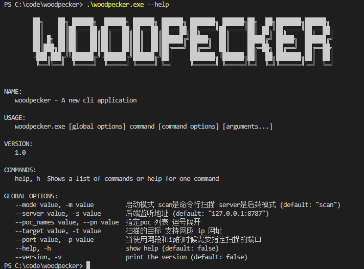
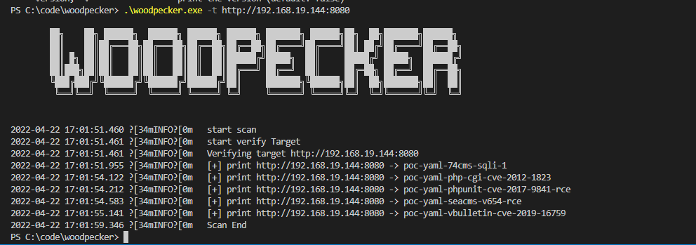
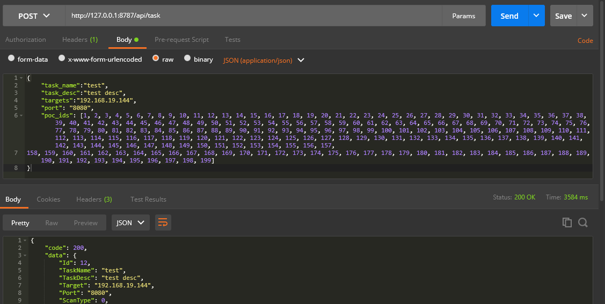
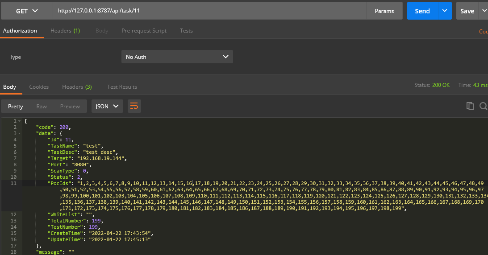

<!--
 * @Date: 2022-04-13 16:40:39
 * @LastEditors: recar
 * @LastEditTime: 2022-04-22 17:57:37
-->
## woodpecker 

啄木鸟  
可以使用xray nuclei yaml 以及go 代码的poc的poc扫描验证器

支持web后端模式和命令行模式
支持进度条数据(存入db中)  
支持yaml go poc导入db脚本  
支持存储xray的和gopoc的最后一次请求响应包入库当web模式

算是自己对cel-go的学习demo

## 使用  

### 编译
windows下:  
`go build -mod vendor cmd/woodpecker.go`  
linux 下:  
`go mod tidy -compat=1.17`  
`go build cmd/woodpecker.go`  

如果没配置代理会慢 先配置go的库为国内代理 `go env -w GOPROXY=https://goproxy.cn,direct`  

### 命令行模式  
帮助信息  
  
开始扫描  
  

poc使用的是pocs下的poc    

### 接口模式

只有接口模式才需要db文件 db文件初始化就是 `woodpecker.exe -m server`  
然后使用 script的几个py脚本将pocs目录下的poc导入到db中  

创建任务  
  
查看任务信息  
  

## poc to db
`python script/goscript2db.py`  
`python script/nucleipoc2db.py`  
`python script/xraypoc2db.py`  

## 更新poc  
直接将pocs目录下的poc更新即可 支持直接将git直接克隆过去  
更新后可以再次支持 上面的script脚本来将新增的poc添加到db中 执行的话会按poc_name来判断是否是新增的 只会添加新增的  

## TODO
- 优化性能
- 存储nuclei的请求响应包
- 目前暂时去掉了 nuclei的fuzzing 和workflow的目录

参考  
https://github.com/WAY29/pocV   
https://github.com/jweny/pocassist  
https://github.com/chaitin/xray  
https://github.com/boy-hack/w14scan  

